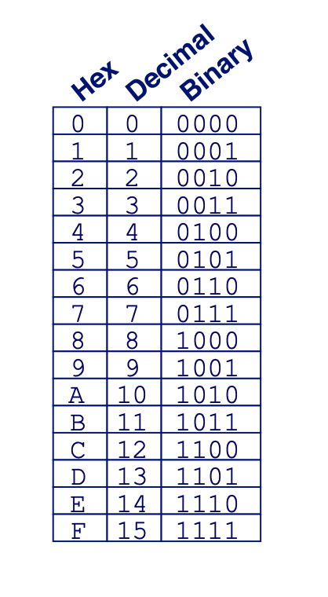
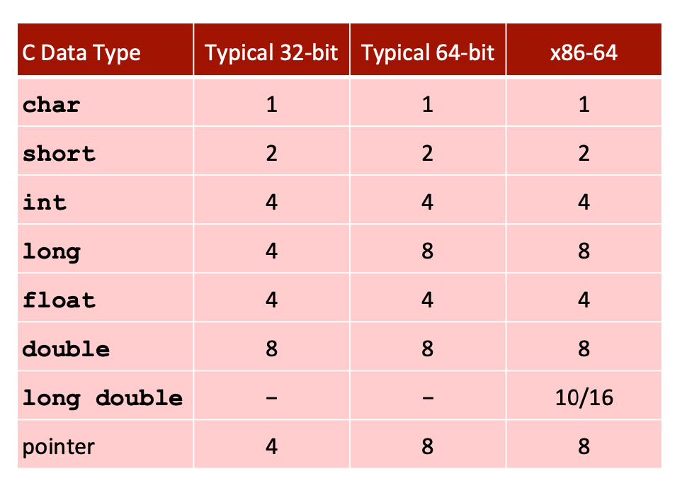
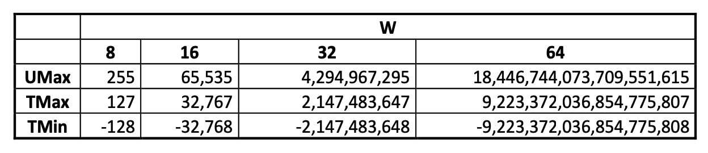
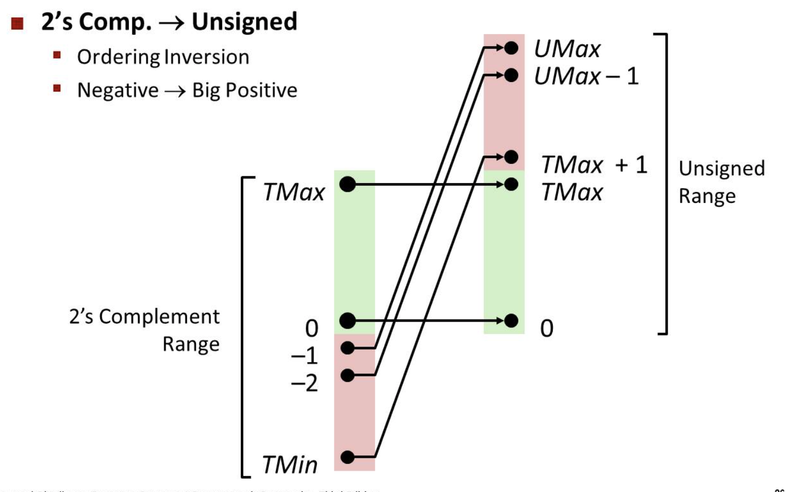
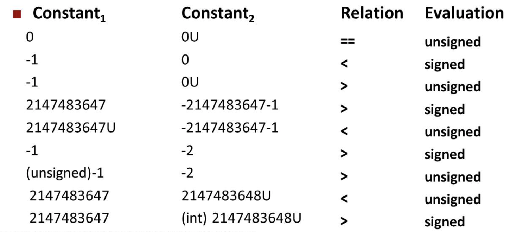
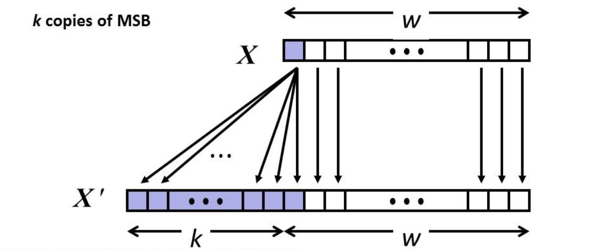

# Bits, Bytes, and Integers
## Everything is bits
* Each bit is 0 or 1 using base 2 representation
* Why bits? Electronic Implementation
    * Easy to store with bistable elements
    * Reliably transmitted on noisy and inaccurate wires (analog value -> digital value; some range belongs to 0 and some range belongs to 1)

## Encoding Byte Values
* Byte = 8 bits
    * Biniary: 00000000 to 11111111
    * Decimal: 0 to 255
    * Hexadecimal: 00 to FF
    <div align="center"></div>
    <div align="center"></div>

## Boolean Algebra
* Algebraic representation of logic
* Encode "True" as 1 and "False" as 0
    * And: `A & B`
    * Or: `A | B`
    * Not: `~A`
    * Xor: `A ^ B`
* General Boolean Algebras operate on Bit Vectors (operations applied bitwise)
* Representing & Manipulating Sets
    * Representation
        * Width $w$ bit vector represents subsets of $\{0, ..., w-1\}$
        * $a_j=1$ if $j\in A$
    * Operations
        * `&`: Intersection
        * `|`: Union
        * `^`: Symmetric difference
        * `~`: Complement
* Operations `&`, `|`, `^`, `~` available in C apply to any "integral" data type


## Logic Operations in C
* `&&`, `||`, `!`
* View 0 as "False"
* Anything nonzero as "True"
* Always return 0 or 1
* Early termination


## Shift Opertions
* Left Shift: `x << y`
    * Throw away extra bits on left
    * Fill with 0's on right
* Right Shift: `x >> y`
    * Throw away extra bits on right
    * Logical shift: fill with 0's on left
    * Arithmetic shift: replicate most significant bit on left
* Undefined Behavior: shift amount < 0 or >= wordsize (`x << (y mod wordsize)`)


## Encoding Integers
* Unsigned Values: $U2B(X) = \sum^{w-1}_{i=0}x_i\cdot 2^i$
* Singed Values: $T2B(X) = -x_{w-1}\cdot 2^{w-1}+\sum ^{w-2}_{i=0}x_i\cdot 2^i$


## Numeric Ranges
* Unsigned Values
    * $UMin = 0$
    * $UMax = 2^w - 1$
* Signed Values
    * $TMin = -2^{w-1}$
    * $TMax = 2^{w-1}-1$
    * $|TMin| = Tmax + 1$
    * $UMax = 2 * TMax + 1$
    * $-TMin = TMin$
* C Programming
    * `#include <limits.h>`
    * `ULONG_MAX`, `LONG_MAX`, `LONG_MIN`
<div align="center"></div>

* Unsigned & Signed Numeric Values
    * Equivalence
        * Same encodings for nonnegetive values
    * Uniqueness
        * Every bit pattern represents unique interger value
        * Each representable integer has unique bit encoding
    * Invert Mappings
        * $U2B(x) = B2U^{-1}(x)$
        * $T2B(x) = B2T^{-1}(x)$
    * Mapping Between Signed and Unsigned
        * Keep bit representations and reinterpret
<div align="center"></div>

* Signed vs. Unsigned in C
    * Constants
        * By default are considered to be signed integers
        * Unsigned if have "U" as suffix
    * Casting
      ```C
      int tx, ty;
      unsiged ux, uy;
      tx = (int) ux; // Explicit casting
      uy = (unsigned) ty;

      tx = ux; // Implicit casting
      uy = ty;

      for (int i = n - 1; i - sizeof(char) >= 0; i --);  // infinite loop
      ```
        * If there is a mix if unsigned and signed in single expression, singed values implicitly cast to unsigned
<div align="center"></div>


## Sign Extension
* Task
    * Given w-bit signed integer x
    * Convert it yo w+k-bit integer with same value
* Rule
    * Make k copies of sign bit
<div align="center"></div>


## Sign Truncating
* Unsigned / Signed: bits are truncated
* Unsigned: mod operation
* Signed: similar to mod: $(x+2^w)\%2^w$
