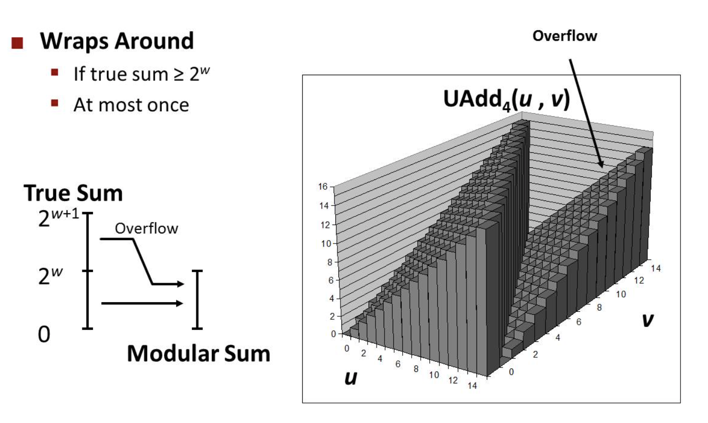
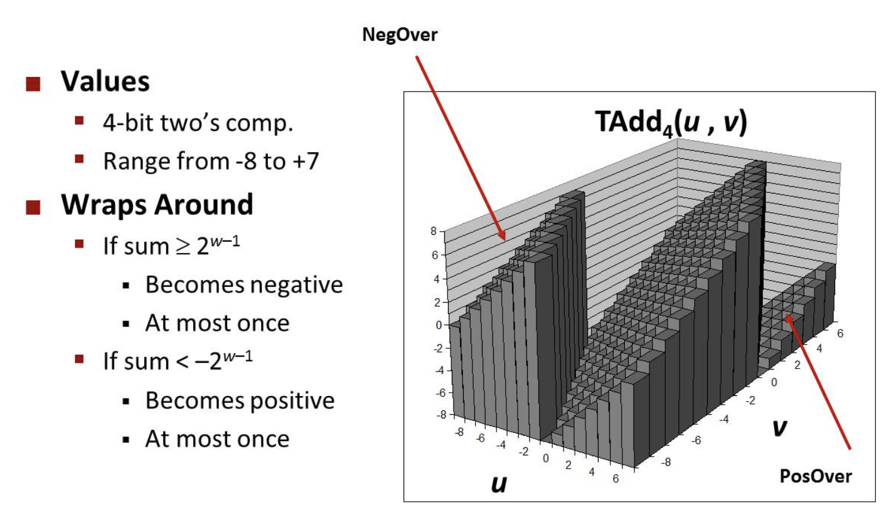
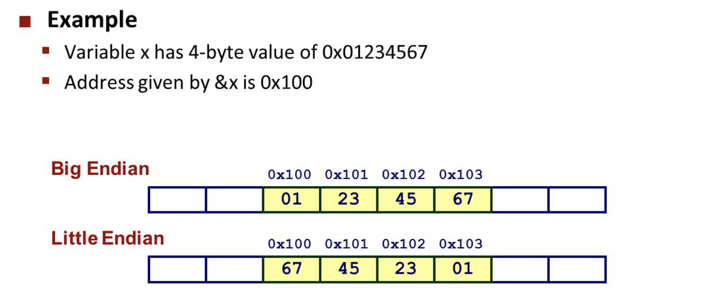

# Bits, Bytes, and Integers (Part II)
## Unsinged Addition
* Standard Addtion Function: Ignores carry output
* Implements Modular Arithmetic: $s = (u+v)mod2^w$
<div align="center"></div>

## Two's Complement Addtion
* TAdd and UAdd have identucak Bit-level Behavior
  ```C
  int s, t, u, v;
  s = (int) ((unsigned) u + (unsigned) v);
  t = u + v
  // Will give s == t
  ```
* TAdd Overflow
<div align="center"></div>

## Multiplication
* Same as adstion, ignores high order w bits
* Unsgined Case
    * $(u*v)mod2^w$
* Signed Case
    * the $w_{th}$ bit decides it'is positive or negtive


## Power-of-2 Multiply with Shift
* Operation
    * $u << k$ gives $u*2^k$
    * both signed and ubeigned
* Shifting and Adding are much faster than multiplication


## Unsigned Power-of-2 Divide with Shift
* $U>>k$ gives $\lfloor u / 2^k \rfloor$
* Uses logical shift


## When should I Use Unsigned
* Do Use When Performing Modular Arithmaetic
* Do Use When Using Bits To Represent Sets
    * Logical right shift, no sign extension


## Btye-Oriented Memory Organization
* Programs refer to data by address
    * Envision memory as a very large aray of bytes
    * An address is like an index into that array
    * A pointer variable stores an address


## Machine Words
* "Word Size"
    * Nominal size of integer-valued data
    * From 32 bits to 64 bits


## Word-Oriented Memory Organization
* Addresses Specify Byte Locations
    * Address of first byte in word
    * Addresses of successive words differ by 4 (32-bot) or 8 (64-bit)


## Byte Oredering
* Conentions
    * Big Endian: Sun, PPC Mac, Internet
        * Least significant byte has highest address
    * Little Endian: x86, ARM processors running Android, iOS, and Windows
        * Least significant byte has lowest address
<div align="center"></div>

## Representing Strings
* Strings in C
    * Reoresented by array of characters
    * Each character encoded in ASCII fromat
        * Standard 7-bit encoding of character set
        * Digit $i$ has code 0x30+$i$
    * String should be null-terminated
        * Final character = 0
* Compatibility
    * Byte ordering not an issue
