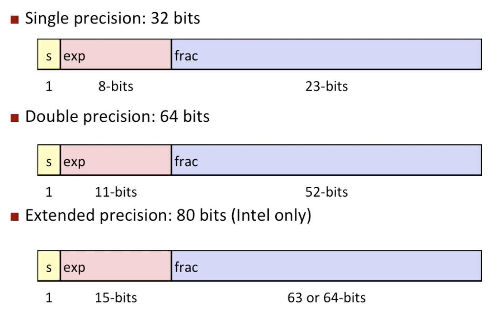
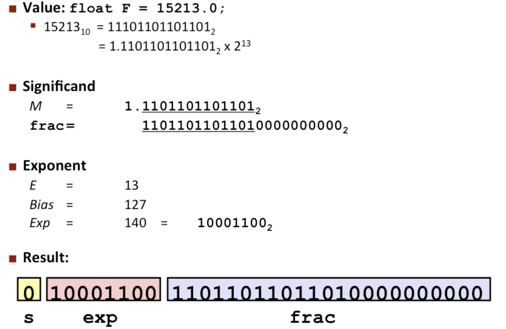
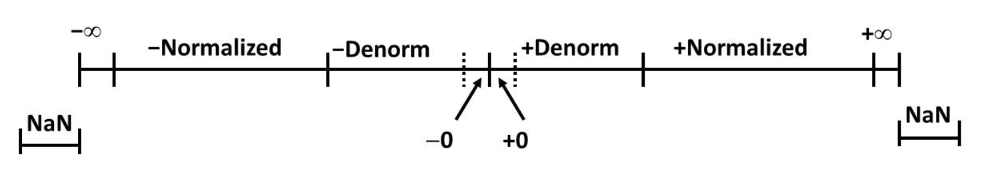
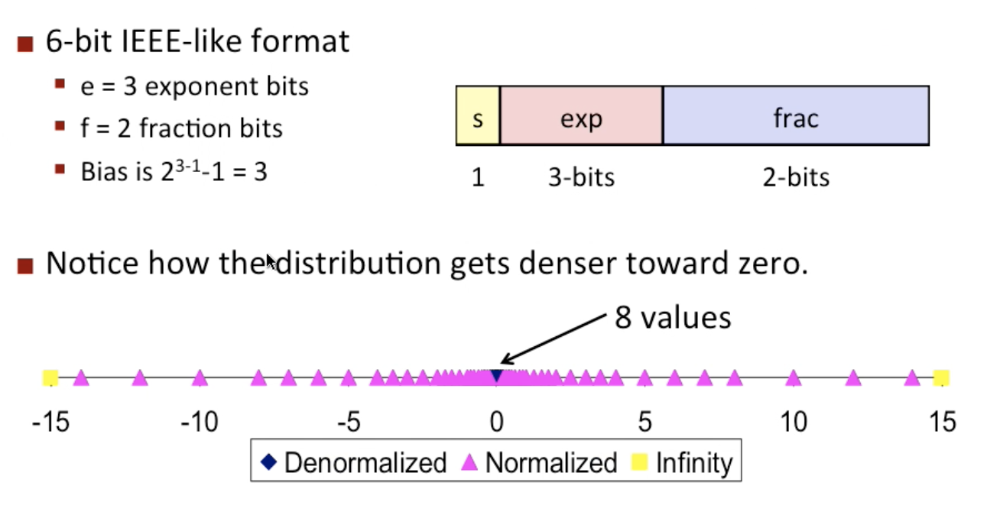

# Floating Point
## Fractional Binary Numbers
* Representation
    * Bits to right of "binary point" reptresent fractional powers of 2
    * Represents rational number: $\sum^i_{k=-j}b_k\times 2^k$
* Observations
    * Divide by 2 by shifting right (unsigned)
    * Multiply by 2 by shifting left
    * Numbers of form $0.111111..._2$ are just below $1.0$, and use noation $1.0 - \varepsilon$
* Limitation
    * Can only exactly represent numbers of the form $x/2^k$, and other rational numbers have repeating bit represenrations
    * Just one setting of binary point within the w bits

## Floating Point Representation
* Numerical Form: $(-1)^sM2^E$
    * Sign bit $s$ determines whether number is negtive or positive
    * Significant $<$ normally a fractional value in range $[1.0,2.0)$
    * Exponent $E$ weights value by power of two
* Encoding
    * MSB s is sign bit $s$
    * exp field encodes $E$ (but is not equal to $E$)
    * frac field encodes $M$ (but is not equal to $M$)
* Precision options
    * Single precision: 32 bits
    * Double precision: 64 bits
    * Extended precision: 80 bits (intel only)

* Normalized Values
    * When: $exp \ne 000...0$ and $exp \ne 111...1$
    * Exponent coded as a biased value: $E = Exp - Bias$
        * $Exp$: unsigned value of exp field
        * $Bias = 2^{k-1}-1$ where $k$ is number of expoent bits
            * Single previdion: 127 ($Exp:1...254,E:=126...127$)
            * Double precision: 1023($Exp:1...2046,E:-1022...1023)$
    * Significant coded with impied leading 1: $M=1.xxx...x_2$
    * $xxx...x$: bits of frac field
    * Minimum when $frac=000...0$ ($M=1.0$)
    * Maximum when $frac=111...1$ ($M=2.0-\varepsilon$)

* Denormalized Values
    * Condition: $exp=000...0$
    * Exponent value $E = 1 - Bias$ (instead of $E=0-bias$)
    * Sinificant coded with implied leading 0: $M=0.xxx...x_2$
    * Case: $exp = 000...0,frac=000...0$
        * Represents zero values
        * Note distinct values: $+0$ and $-0$
    * Case: $exp = 000...0,frac \ne 000...0$
        * Numbers closet to $0.0$
        * Equispaced

* Special Values
    * Condition: $exp=111...1$
    * Case: $exp=111...1,frac=000...0$
        * represents value $\infty$
        * Operation that overflows
        * Both positive and negtive
        * E.g., $1.0/0.0 = -1.0/-0.0 = +\infty$
    * Case $exp=111...1,frac\ne 000...0$
        * N Not-a-Number (NaN)
        * Represents case when no numeric value can be determined
        * E.g., $sqrt(-1), \infty - \infty, \infty \times 0$

* Special Properties
    * FP zero same as Integer zero: all bits are 0
    * Can use Unsigned Interger Comparison
        * Must first compare sign bits
        * Must consider $-0=0$
        * NaNs problematic

## Floating Point Operations
* Basic idea
    * First compute exact result
    * Make it fit into desired presion
* Rounding: Round-To-Even
    * Binary Fractional Numbers
      * "Even" when least significant bit is 0
      * "Half way" when bits to right of rounding position is $100..._2$
* FP Multiplication
    * $(-1)^{s1}\ M1\ 2^{E1}\times(-1)^{s2}\ M2\ 2^{E2}$
    * Exact Result: $(-1)^s\ M\ 2^E$
        * Sign s: $s1^{\wedge} s2$
        * Significand M: $M1 \times M2$
        * Exponent E: $E1+ E2$
    * Fixing
        * If $M \geq 2$, shift M right, increment E
        * If E out of range, overflow
        * Round M to fit frac precision
* FP Addtion
    * Assume $E1 \gt E2$
    * Exact Result: $(-1)^s\ M\ 2^E$
        * Sign s, sinificand M: Result of signed align & add
        * Exponent E: E1
    * Fixing
        * if $M \ge 2$, shift M right, increment E
        * if $M \lt 1$, shift M left k positions, decrement E by k
        * Overflow if E out of range
        * Round M to fit frac precision
* Mathematical Properties
    * Closed under addtion, but may generate infinity or NaN
    * Commutative
    * Not Associative
    * Every element has additive inverse, except for infinity & NaNs
    * Monoticity, except for infinity & NaNs
    * 1 is multiplication identity
    * Multiplication can not distribute over addtion

## Floating Point in C
* `float`: single precision
* `double`: double precision
* Conversions / Casting
    * Casting between `int`, `float`, and `double` changes bit representation
    * `double`/`float` to `int`
        * Truncates fractional part
        * Like round toward zero
        * Not define when out of range or NaN: Generally sets to TMin
    * `int` to `double`
        * Exact conversion, as long as `int` has $\leq 53$ bit word size
    * `int` to `float`
        * Will round according to rounding mode
