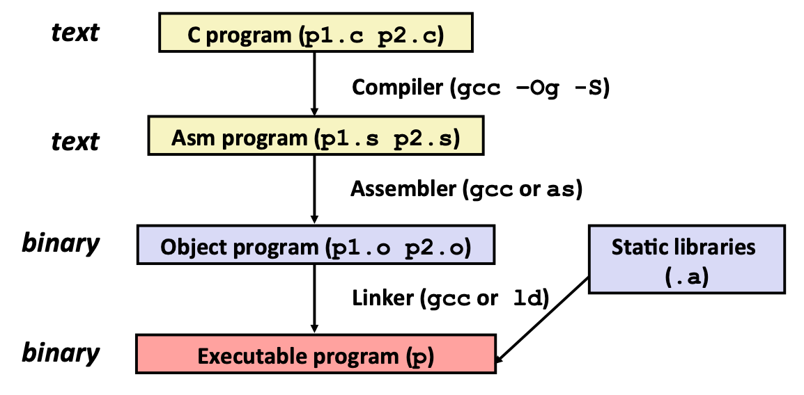
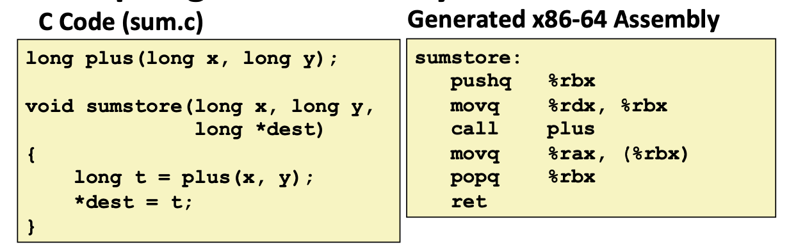
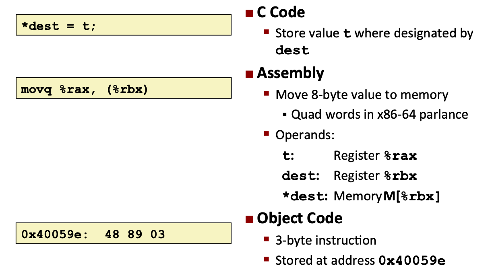
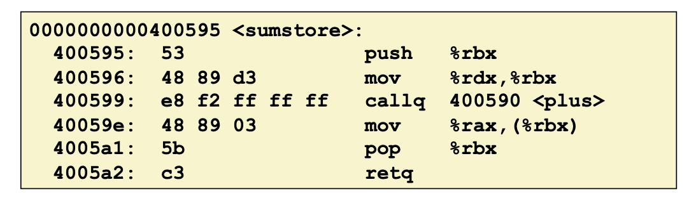
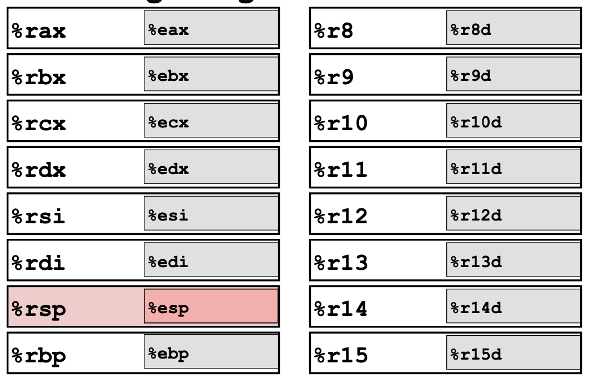
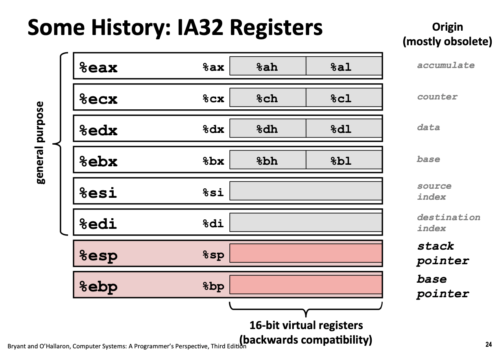
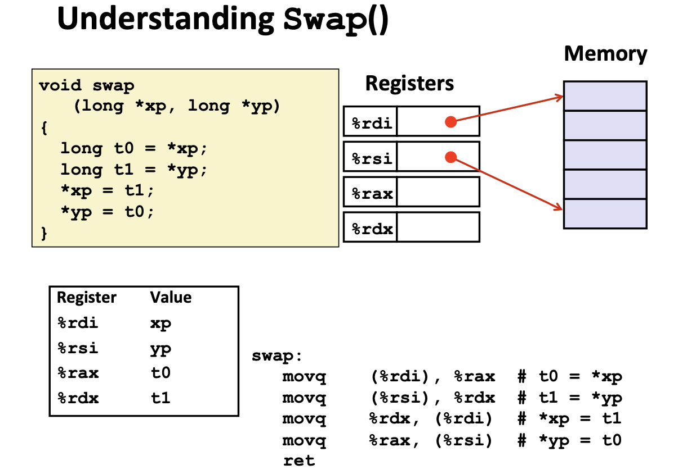
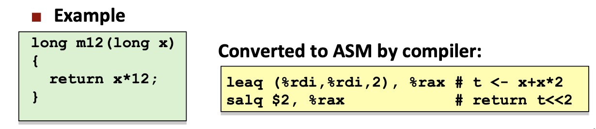
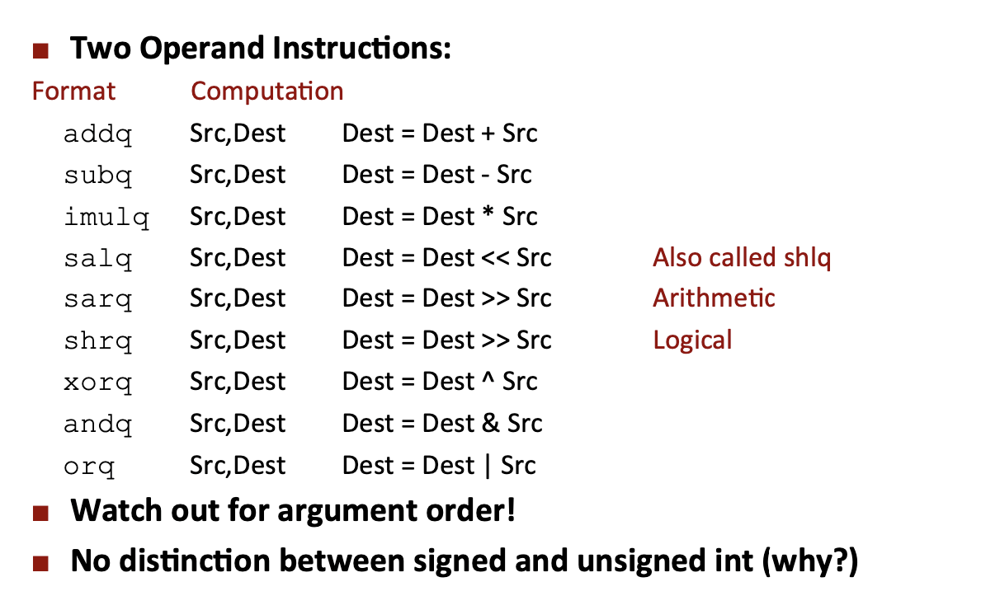
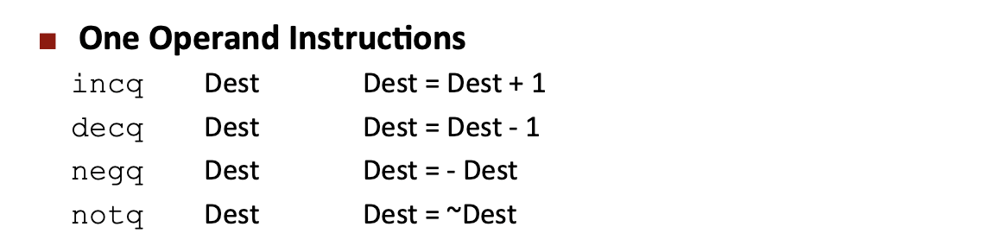

# Machine-Level Programming I: Basics

## Interl x86 Processors
* Complex instruction set computer (CISC)
* Reduced instruction set computer (RISC)
* 8086, 386, Pentium 4E, Core 2, Core i7
* IA32 -> x86-64

## C, Assembly, Machine Code
* Definition
    * Architecuture: (also ISA: instruction set architecture) The parts of a processor design that one needs to understand or write assembly / machine code
    * Microarchitecture: Implementation of the architecture
    * Code Forms:
        * Machine Code: The byte-level programs that a processor executes
        * Assembly Code: Atext representation of machine code
    * Example ISAs:
        * Intel: x86, IA32, Itanium, x86-64
        * ARM: Used in almost all mobiles
* Assembly / Machine Code View
    * Programmer-Visible State
        * PC: Program counter
            * Address of next instruction
            * Called "RIP" (x86-64)
        * Register file
            * Heavily used program data
        * Condition codes
            * Store status information about most recent arithmetic or logical operation
            * Used for conditional branching
        * Memory
            * Byte addressable array
            * Code and user data
            * Stack to support procedures
* Turning C into Object Code
    * Code in files `p1.c1` `p2.c`
    * Compile with command: `gcc -Og p1.c p2.c -o p`
        * Use basic optimizations (`-Og`)
        * Put resulting binary in file `p`

* Assembly Characteristics: Data Types
    * "Integer" data of 1, 2, 4 or 8 bytes
        * Data values
        * Addresses (untyped pointers)
    * Floating point data of 4, 8, or 10 bytes
    * Code: Byte sequences encoding series of instructions
    * No aggregate types such as arrays or structures
* Assembly Characteristics: Operations
    * Perform arithmetic function on register or memory data
    * Transfer data between memory and register
        * Load data from memory into register
        * Store register data into memory
    * Transfer control
        * Unconditional jumps to / from procedures
        * Conditional branches
* Object Code
    * Assembler
        * Translates `.s` to `.o`
        * Binary encoding od each instruction
        * Nearly-complete image of executable code
        * Missing linkages between code in different files
    * Linker
        * Resolves references between files
        * Combines with static run-time libraries
        * Some libraries are dynamically linked

* Disassembling Object Code
    * Disassembler
        * `objdump -d sum`
        * Useful tool for examining object code
        * Analyzes bit pattern of series of instructions
        * Produce approximate rendition of assembly code
        * Can be run on either `a.out` (complete executable) or `.o` file
    * Within gdb Debugger
        * `gdb sum`
        * `disassemble sumstore`
        * `x/14xb sumstore` : Examine the 14 bytes starting at `sumstore`

* x86-64 Integer Registers

    * `%rxx` means 64 bits, and `%exx` means 32 bits
    * 16 registers

* IA32 Resgisters

* Moving Data
    * `movq Source, Dest`
    * Operand Types
        * immediate: Constant integer data
            * Example: `$0x400`, `$-533`
            * Like C constatnt, but prefixed with `$`
            * Encode woth 1, 2, or 4 bytes
        * Register: One of 16 integer registers
            * Example: `%rax`, `%r13`
            * `%rsp` reservef for special use
            * Others have special uses for particular instructions
        * Memory: 8 consecutive bytes of memory at address given by register
            * Simplest example: `(%rax)`
            * Various other "address modes"

* Simple Memory Addressing Modes
    * Normal `(R)` `Mem[Reg[R]]`
        * Resgister R specifies memory address
        * Pointer dereferencing in C
        * `movq (%rcx),%rax`
    * Displacement `D(R)` `Mem[Reg[R]+D]`
        * Register R specifies start of memory region
        * Constant displacement `D` specifies offset
        * `movq 8(%rbq),%rdx`
    * The arguments always come in some specific registers
        * `%rdi` will be the first argument register
        * `rsi` will be the second argument register

* Complete Memory Addressing Modes
    * Most General Form
        * `D(Rb,Ri,S)` `Mem[Reg[Rb]+S*Reg[Ri]+D]`
        * `D`: Constant "Displacement" 1, 2, or 4 bytes
        * `Rb`: Base register: Any of 16 integer registers
        * `Ri`: Index register: Any, except for `%rsp`
        * `S`: Scale 1, 2, 4, or 8
    * Important when implementing arrays
    

## Arithmetic & Logical operations
* Address Computation Instruction
    * `leaq Src, Dst`
        * `Src` is address mode expression
        * Set `Dst` to address denoted by expression
    * Uses
        * Computing addresses without a reference
        * Computing arithmetic expressions of the form x + k*y (k = 1, 2, 4, or 8)
        

